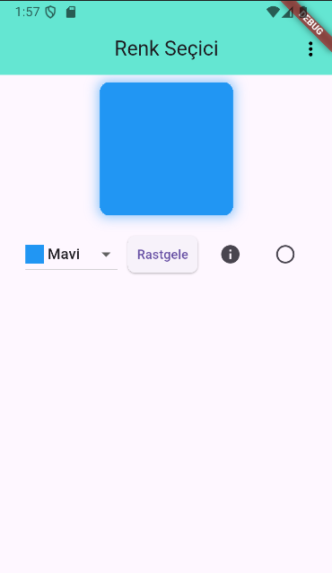
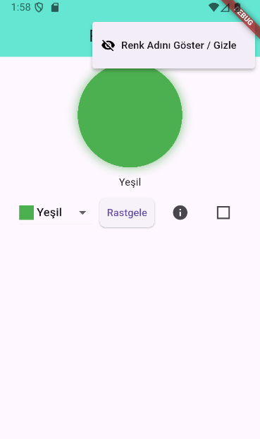
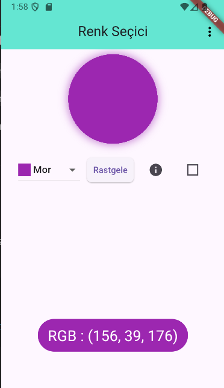
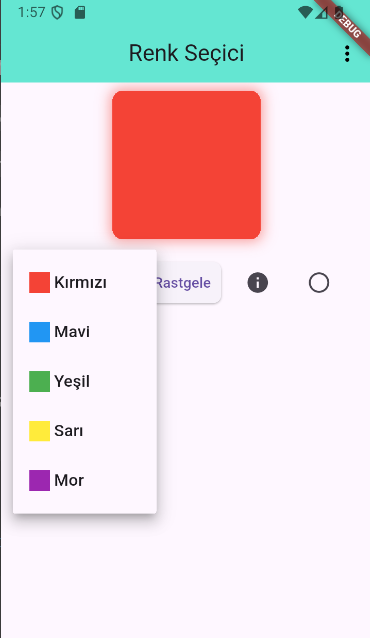

# 🎨 Renk Seçici Uygulaması

Flutter ile geliştirilmiş, kullanıcı etkileşimine dayalı bir renk seçme uygulamasıdır.  
Aşağıdaki özellikleri içerir:

- Dropdown menü ile renk seçimi  
- Rastgele renk oluşturma  
- Renk adını gösterme/gizleme (toggle özelliği)  
- Renk kutusunu daire veya kare şeklinde gösterme  
- Seçilen rengin RGB kodunu gösterme

---

## 🧰 Kullanılan Teknolojiler

- [Flutter](https://flutter.dev/)
- Dart
- Material Design
- StatefulWidget

---
## 🖼️ Ekran Görüntüleri

  
  &nbsp;
  
  &nbsp;
  
  &nbsp;
  

👨‍💻 Geliştirici
- Harun Mercan – Gazi Üniversitesi – Bilgisayar Mühendisliği 🎓
- Flutter & Dart öğrenme sürecimin bir parçası olarak geliştirilmiştir.
- 🔗 [GitHub profilim](https://github.com/HarunMercan1)

📝 Notlar
- Kodlar sade, okunabilir ve modülerdir. 
- Öğrenme amaçlı yazılmıştır ama genişletmeye uygundur.
- Geri bildirim ve katkılara her zaman açığım!

